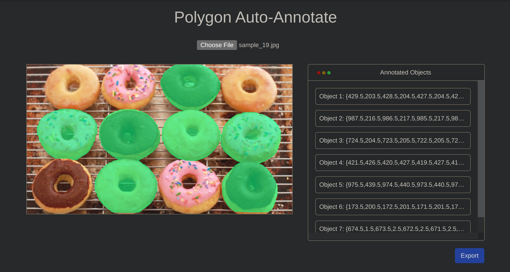

# Polygon Auto-Annotate Tool

## Introduction
- If you are interested in building a dataset for training an image segmentation model, then you have to come up against polygon labeling. Polygons are more precise than bounding boxes but, take more time to apply labels to numerous instances in a large number of images.
- Now that, Polygon Auto-Annotate Tool is a simple-UI application, in which you can apply a polygon annotation to objects in an image with as few as a drag and drop. It takes advantage of **an instance segmentation model** to automatically segment items and create polygon masks or boundaries.

## Major features
### 1. The basics
- **Drag and drop a region** containing the entirety of the object that you would like to segment. Make sure that there is a reasonable padding surrouding the object, since the model does not work well when the selected region is too tight to the object.
- A cropped image will be shown up in a modal box. You have to click on the object to specify the segmented target.


### 2. Remove a mask
- Whenever you feel disappointed with a mask, you certainly can remove that mask from annotation. **Ctrl + Click** on the mask and the image will be updated. If there is no mask in that place, no action will be executed.


### 3. Include or exclude regions (auto-complete)
- **Shift + Click** on a point, then a small reasonable region will be added to the current mask. A unit added is a superpixel that this point belongs to.


- Notice that the cluster is added to the newest mask, not the nearest mask. We will amend this limit in the future.
- Contrastively, **Alt + Click** on a point will erase a cluster from the mask. If there is no mask in that place, no action will be taken.


### 4. Export
- Click on the **Export** button to download the Json file of annotations. For the sake of simplicty, we only maintain a simple schema as follow:
```javascript
{
    "filename": "sample_image.jpg",
    "annotations": [
        {
            "name": "Object_1",
            "boundary": []
        },
        {
            "name": "Object_2",
            "boundary": []
        },
        ...
    ]
}
```
- **TODO**: Allows output to standard formats such as: COCO and Pascal VOC.

## Demo
👉 Check out this website: [polygon-auto-annotate-tool.fly.dev](https://polygon-auto-annotate-tool.fly.dev/)
- Because of the hardware resources constraint, it may take time to run the website (~5-7 seconds for an inference), and it can run out of memory if you test on large images. We recommend to install and run the app locally for a better experience.

👉 Video for how to install and demo: [demo-video](https://drive.google.com/file/d/1xmZ74-xW3YQKbkzqEEeqd7hf_JcUW0wW/view?usp=sharing)

## Technical Overview
- *For segmentation:* we apply the [BCNet](https://github.com/lkeab/BCNet) architecture, which is the SOTA of the task instance segmentation in 2021. We also take advantage of [Sklearn's SLIC implementation](https://scikit-image.org/docs/dev/api/skimage.segmentation.html#skimage.segmentation.slic) to segment image into superpixels. This type of segmentation is later use in Include/Exclude handling.
- *For visualization:* we use the [FAIR's Detectron2](https://github.com/facebookresearch/detectron2), which is a great library provides utilities in detection and segmentation algorithms. It can be considered as the core technology behind this repository.
- *For app development:* we build a simple Flask app and use Gunicorn to serve the app.
- *For deployment:* the app is dockerized and deployed to [Fly.io](https://fly.io/), which is a hosting platform supporting quick deployment.
## Installation
After the successful installation, the application will be available at http://localhost:8080
### 1. Build with Docker

Easy install with Docker.
#### Build Dockerfile
```bash
# Find Dockerfile and build an image.
$ docker build -t "polygon-auto-annotate-tool" .

# Run in a new container
$ docker run --name "polygon-auto-annotate-tool" -p 8080:8080  "polygon-auto-annotate-tool"
```

#### Pre-built Docker Image
Dockerhub pre-buiilt image: [Dockerhub-link](https://hub.docker.com/r/nxquang2002/polygon-auto-annotate-tool)
```bash
$ docker pull nxquang2002/polygon-auto-annotate-tool

# Run the image
$ docker run --name "polygon-auto-annotate-tool" -p 8080:8080  "nxquang2002/polygon-auto-annotate-tool"
```

### 2. Build from source
Or you can follow these steps to install:

```bash
$ conda create -n polygon-annotate python=3.9 -y
$ conda activate polygon-annotate

# Install packages
$ pip install -r requirements.txt

# Clone and build detectron2 from source. Since it is modify 
# to adapt to this app, we have forked and modified the source code.
$ pip install -e git+https://github.com/nxquang-al/detectron2.git#egg=detectron2

# Download model weights from Google Drive.
$ gdown https://drive.google.com/uc?id=1qhoiYU92BvJuum74rY6LpiG7-FoEqoO9 -O ./models/
```

## User Guides
- Allowed operations:
    - *Drag and drop*: select a region that contains the object
    - *Ctrl + click*: remove the mask, if there is no mask, nothing is taken.
    - *Shift + click*: Include click, add a reasonable region to the current mask (auto-complete).
    - *Alt + click*: Exclude click, erase a region from the mask (auto-complete).
    - *Ctrl + Scroll up/down*: zoom in/out the image.
    - Click on **Export** to download Json file of annotations.

## Acknowledgement
- This application is inspired by the [Roboflow Smart Polygon Labeling](https://blog.roboflow.com/automated-polygon-labeling-computer-vision/), but worse. Instead of labeling in one click, our app requires more operations but, provides more flexibility in selecting objects.
- The repository is built using the [Detectron2](https://github.com/facebookresearch/detectron2) library, thanks for their open-source code! We build this for academic purposes, not for commercial purposes.
- Thanks to [BCNet](https://github.com/lkeab/BCNet)  authors for their excellent work!
